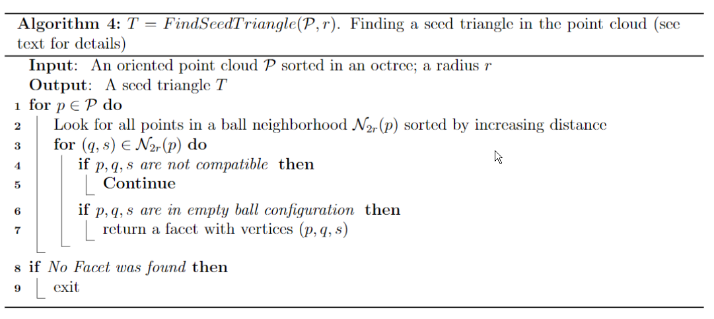
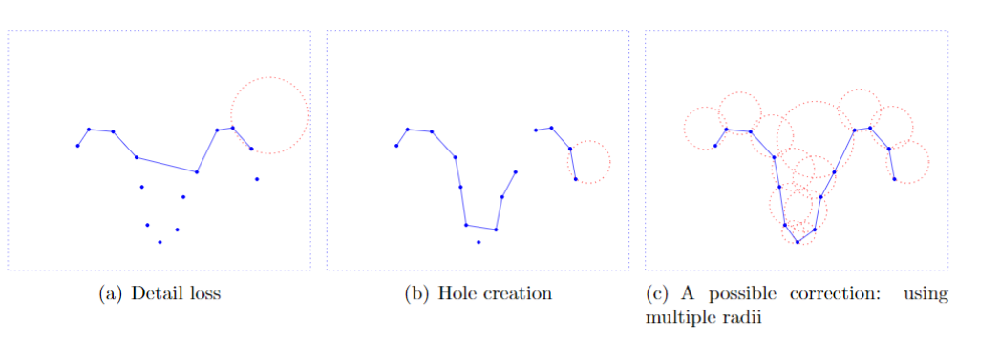

## Introduction and the basic idea

P be a sample of a M, a 3D manifold.
P is dense engouh (probaly satisfied by the Poisson sampling)

> The water-tightness conditionis that an __r__-ball cannot pass through P without touching 3 points. _forming a seed triangle_

> The ball is then rotated around two of these three points:  it remains in contact with the two points and rotates around the axis they form until it touches another point. Hence the creation of an expansion edge front, formed originally with the three edges of the seed triangle and then expanded.

Cool videos and images here: https://medium.com/@datanmay/surface-reconstruction-from-point-cloud-data-6849426219e4

In brief:

1. 3 points in the dense sampling __P__ form a triangle if a _r_ ball does not touch any other point
2. Ball pivots around an edge untils it touches another points
3. Countinues until all reachable edges have been tried

The struture is a manifold with holes

__What does the ball roatate around__

## Data Structures

1. Point search and sorting algo for seeing the neibour points.
2. A surface mesh connectivity structure must be constructed.

### 2.1 Search algo.

Pass

### 2.2 Mesh

* Seed facet: the starting face
* Expansion front: a set of edges from which the triangulation will be expanded. the edge of which has only one facet

### 2.3 Guarantees for Triangles and Edges

Sth about the properties of the points' normal after trianuglation

## 3 Implementation details

The neighborhood queries are done by octtree structure

### 3.1 Octree

The octree data structure representing the points in the cloud

### 3.2 Neigborhood queries

An function `getNeighbors(p, P, r)` should be able to do the job.

__If the octree were not used, should this also change with it too?__

## The actual algo.

1. _Find a seed triangle_: The algorithm looks for 3 __orphan__ verties that lie on the surface of an empty-interior of a given radius
2. _Expanding the triangulation_: Triangles are added to the triangulation by pivoting a ball around front edges until no more front edge remains

### 4.1 Finding a seed triangle (`FindSeedTriangle(P, r)`)

Line 4 check the geometry condition in 2.3

### 4.3 `ExpandTriangulation(T,P,r)`

Anchoring from one end, the ball rotates and see if it 'captures' another points, satisfying:
1. Empty sphere
2. Geometry properties in 2.3

### 4.4 Post-Processing

Using multiple radius might fix the problem of precision.

